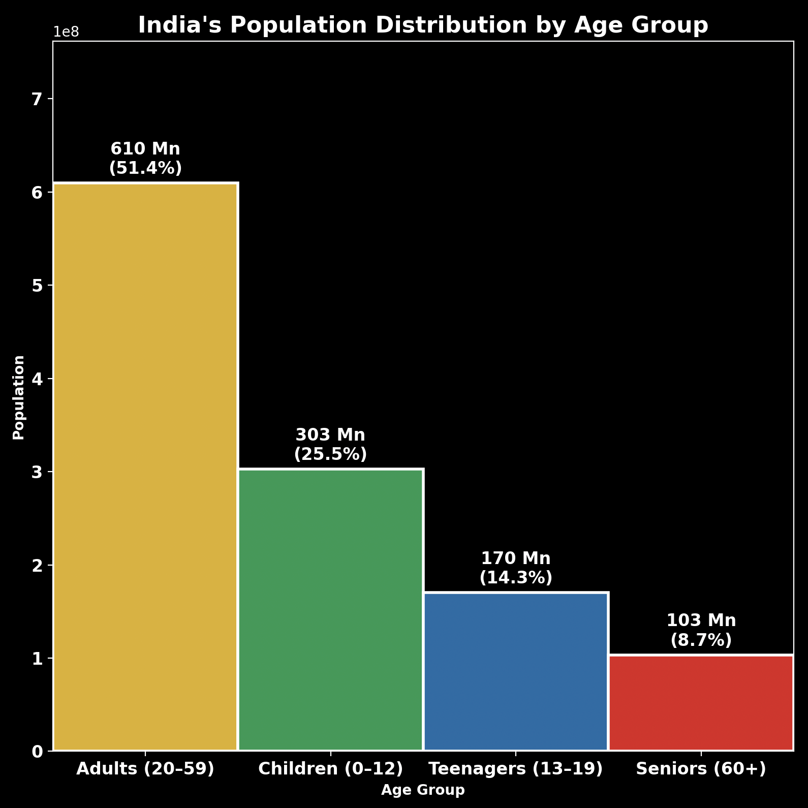

# India's Age Distribution Visualization

This project visualizes the distribution of India's population by age groups using data from an official demographic dataset.

## Features
- Data cleaning and transformation using pandas
- Custom age bins (Children, Teenagers, Adults, Seniors)
- Bar chart with sorted values and dark-themed aesthetics
- Annotated exact population and percentages on each bar

## Tools Used
- Python
- Pandas
- Seaborn
- Matplotlib

## Output

